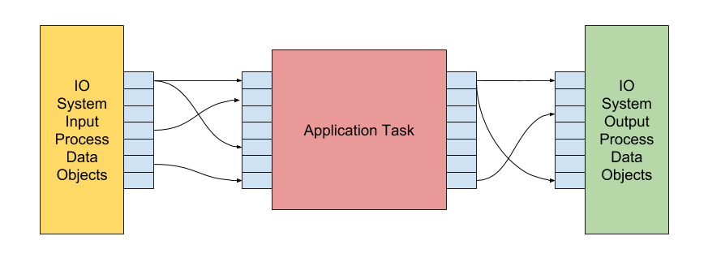

# RikerIO

RikerIO is a small framework that helps connecting IO Systems like General Purpose IOs or Bussystems easily with your application task.



## Build

The Library is build using Meson, simply do the following from the root directory:
```
meson ./build
cd build
ninja
mkdir build
```

## Start the Server

Best way is to start this as the root user.

```
rio-server --id=default --size=4096
```

## License
LGPLv3  
